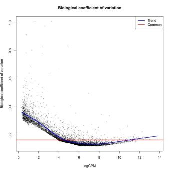
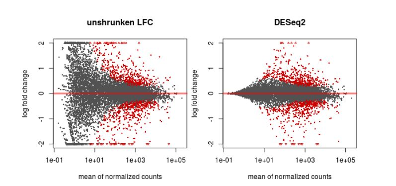
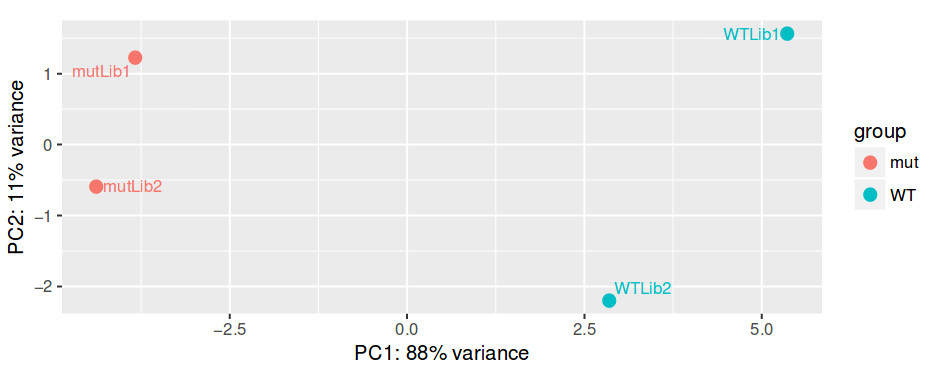
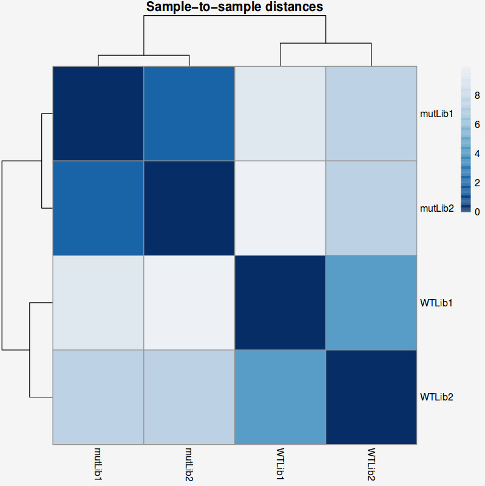
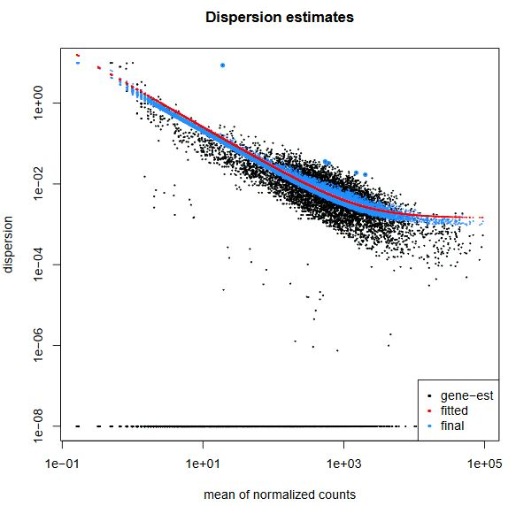
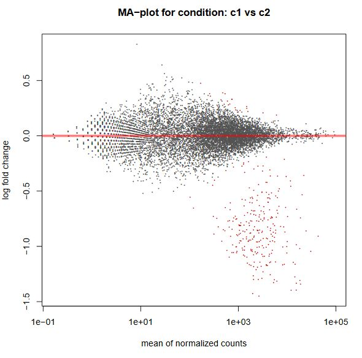
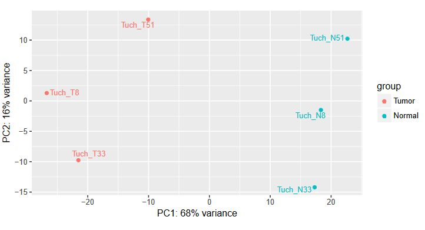
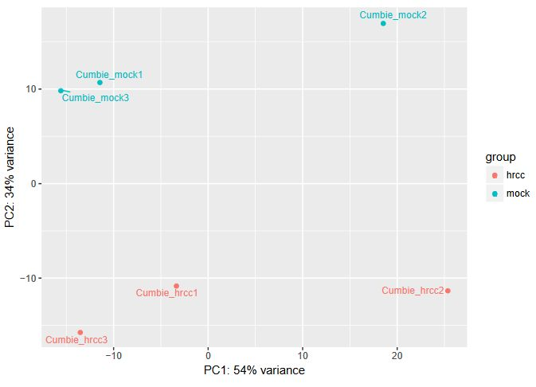
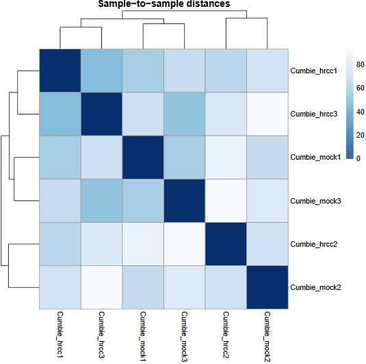

## <a id="LO8.1">8.1 -  Using the R packages edgeR and DESeq2 to produce a pairwise differential expression analysis</a>

We now have a table of "raw" reads counts per gene for each sample. Since there will be different number of reads for each sample, we first need to normalize the counts. For this, we can just divide each gene count by the total number of reads for that sample (transforming it into a relative number). Since numbers are usually on the order of millions, this would make for very small numbers, so the most common measure is to divide by the total number of millions of reads (eg. divide by 5, instead of 5 million). This way, we transform "raw" counts into a relative number of "counts per million reads", or CPM.

**QUESTION**:  What are the CPM for gene Rpn12R (Fbgn0036465) in all the guilgur samples starting from the featureCounts table?

Click Here to see the answer

<ul>
  <li>WT Lib1: 0</li>

  <li>WT Lib2: 8.90</li>

  <li>mut Lib1: 1389.29</li>

  <li>mut Lib2: 1422.17</li>
</ul>

 

It is also common to normalize counts according to gene length. One measure that is often used is RPKM (Reads per Kb per Million reads) in case of single-end data, or FPKM (Fragments per Kb per Million Reads) in case of paired-end data. This is simply obtained by dividing the CPM by the number of Kbs of a gene. For example, gene Rpn12R has 0.94kb (it is a single exon gene), so the RPKM in mut Lib 1 is 1185.29 (1114.17/0.94). Having a normalized RPKM value may lead us to think that we can now safely compare gene expression not only between samples, but also between genes of the same sample. We should always avoid comparing expression values of different genes, because read counts depend on gene length non-linearly, and also on factors such as GC content of the gene.

Nonetheless, even to compare the same gene between samples, this first normalization is usually not enough. You need to be constantly aware that sequencing is a sampling experiment. If in one sample there is a gene or set of genes very highly expressed, then the amount of reads available for the rest of the genes is lower than for other samples where the highly expressed gene is not so highly expressed. So, many genes that may not be differentially expressed will appear so just because of this sampling artifact.

If we assume that most genes are not differentially expressed, then the ratio of counts between samples should be the same for most genes. This assumption is the basis for many types of normalization steps. One simple process consists of obtaining a reference sample where each gene counts is the mean of that gene counts in all samples. Then, for each sample, calculate the ratio of each gene count against the gene count in the reference. For most genes, this ratio should be 1 (under our initial assumption). Therefore, the median (to avoid the issue of outliers) can be used as a sample specific normalization factor.

After normalization, the next step is to apply a statistical test for differential expression. For this we need to make a model, usually based on a statistical distribution. Given that sequencing data is based on discrete counts, most of these popular methods are based on derivations of the binomial distribution. For most experiments, the distribution that seems to fit best distribution of normalized gene expression is the negative binomial.

After normalization, we need to estimate the parameters of the distribution, as well as variance in those parameters, namely how much the (normalized) counts vary between the different samples. This variation is clearly gene dependent, since highly expressed genes vary more in terms of absolute value, and low expressed genes vary more in terms of % of gene expression (fold change). If one only looks at fold change without taking variation into account, we’re more likely to have low expressed genes as differentially expressed. Therefore, we need to accurately estimate variation per gene. But usually we have a limited number of replicates, insufficient for the accurate estimation of parameters. We thus need to find a way to produce such estimates, and we need specialized tools to do it.

There are many freely available tools to perform normalization, estimate variance and perform statistical tests for differential expression. The most commonly used, and that have been demonstrated to work well under most conditions, are the R packages [DESeq2](https://bioconductor.org/packages/release/bioc/html/DESeq2.html)) and [edger](https://bioconductor.org/packages/release/bioc/html/edgeR.html).

DESeq applies the normalization with the median of the ratio of gene expression like we saw before. EdgeR applies a similar, although more sophisticated, approach (trimmed mean of M-values, or TMM in short). TMM assumes that the log fold change between any sample and a reference sample (M-value) is roughly 0 for most genes. The genes with extreme M values and extreme absolute expressions values (A) are removed (trimmed) from the calculation of the normalization factor, and a bigger weight is given to genes with less variance.

To estimate variances, a strategy that is used by edgeR and DESeq2 is to bin genes with similar expression and fit a curve, assuming that genes with similar expression have a similar variance. The parameter used to define the curve is then used as a baseline to reestimate the "true" difference of gene expression between groups of samples. Finally, the assumption that most genes are not differentially expressed is also used to rescale the variance, namely by making it constant at all bin levels.

We then test each gene for differential expression, and we obtain a probability for the test. Since we test thousands of genes, some genes may get good p-values just by chance. Therefore, we need to do multiple test correction. One way is to multiply each p-value by the number of tests (a method called Bonferroni correction). This is nonetheless too strict and we usually end up not having anything differentially expressed. Other methods are less stringent while maintaining a rigorous control on the false positives. The most commonly used method is the Benjamini-Hochberg, which applies a correction proportional to the ranking of the pvalue (multiplies by number of tests and divide by rank), guaranteeing a user-specified error rate. Another way of minimizing the number of tests is to filter out the genes that have very low expression in all samples.

 
 

## <a id="LO8.2">8.2 - Visualization and interpretation of results</a>

**TASK**: In Galaxy, use DESeq2 with the featureCount tables you obtained previously for the guilgur data. Name the factor as "Genotype", with the fist factor value the "WT" and the second "Mutant". For each factor value select the appropriate results of the two replicates. Select the option to output normalized values, and leave the other parameters at default and run.

**QUESTION:** What information is in the DESeq2 result file?

Click Here to see the answer
<pre>
<ul>
  <li> <strong>GeneID</strong> (The identifier of the gene - in this case the Flybase identifier)</li>

  <li> <strong>Base Mean</strong> (The mean normalized counts of all the samples - a measure of how much is a gene expressed)</li>

  <li> <strong>log2(FC)</strong> - log2 of the Fold Change (when positive, more expressed in one group than the other, and the reverse when negative)</li>

  <li> <strong>StdErr</strong> - a measure of the confidence in the true value of the estimated log2(FC)</li>

  <li> <strong>Wald-Stats</strong> - A value measuring how far is the observed log2(FC) from the 0 taking the StdErr into account</li>

  <li> <strong>P-value</strong> - A value measure how likely it is to obtain the observed log2(FC) by chance</li>

  <li> <strong>P-adj</strong> - The P-value corrected for multiple testing (the value that should be used in the end)</li>
</ul>
</pre>

 

**QUESTION:** How many genes were detected to be differentially expressed (P-adj < 0.05)?

Click Here to see the answer

Only the gene FBgn0036465 (Rpn12R). The gene FBgn0003300 (run), despite having a bit more expression in the mutant, is not considered to be significantly differentially expressed.

 

**QUESTION:** What information is in the DESeq2 plots?

Click Here to see the answer
<pre>
<ul>
  <li> <strong>PcA plot</strong> - Displays the samples through a projection that most explain the variation between samples</li>

  <li> <strong>Sample-to-Sample Distances</strong> - Like the previous plot, it displays how similar are the samples between each other</li>

  <li> <strong>Dispersion estimates</strong> - A plot displaying the approximations DESeq2 does to estimate the true log2(FC)</li>

  <li> <strong>Histogram of P-values</strong> - As the name implies, it depicts the distribution of P-values for all genes</li>

  <li> <strong>MA-plot</strong> - plots the M (fold change) against the A (total expression) for all genes</li>
</ul></pre>

<strong>In this case</strong>, since there were only 8 genes, the plots displaying gene by gene information were basically empty

 

Even before interpreting the results of the differential expression analysis, we should have an idea of how the samples compare to each other. For this, we can look at plots such as Principal Coordinate Analysis (PCoA) or Multi-Dimensional Scaling (MDS). The way each software implements these plots vary a bit, but in short, they provide some evidence for the relatedness of the samples. In a nutshell, samples are compared against each other, generating a matrix of distances. The, the two components explaining most of the variation between samples are calculated (each component being a linear combination of samples). Ideally, we should have the expected biological variation separated along the first component. Another important aspect to consider is how much of the variance is explained by each of the components. Again, ideally, the first component should explain as much as possible the observed variation.

 

**QUESTION:** How is the biological variation separated in the PCoA plot you obtained for the guilgur dataset?

Click Here to see the answer

The Genotype is separated clearly by the first axis in the PCoA, which explains XX% variation. Nonetheless, there is also

 

Another common plot shows the hierarchical clustering of samples by explicitly displaying a heatmap with the full matrix of distances between the samples, where samples are grouped according to the distance they have to each other.

**QUESTION:** How is the biological variation separated in the heatmap plot you obtained for the guilgur dataset?

Click Here to see the answer

The samples sharing the genotype are clearly closer together.

 

**TASK**: In Galaxy, use DESeq2 to perform a pairwise comparison with the count results you obtained for the Trapnell dataset. Name the factor "Condition" and two factor variables "C1" and "C2", with 3 replicates each.

**QUESTION:** How many genes were detected to be differentially expressed (P-adj < 0.05)? Hint: you can use the filter tool in Galaxy.

Click Here to see the answer

There are 267 genes with adjusted p-value less than 0.05.

 

DESeq2 and edgeR also show the estimates of the biological coefficient of variation (BCV), which depicts the sample variation of genes according to their expression, and illustrates the variation correction the software performed, as we discussed.

**QUESTION:** What can you see in the dispersion plot for the Trapnell dataset?

Click Here to see the answer

You can see a curve (in red) approximating the dispersion (y axis) along expression (x axis). As you can see, dispersion is not uniform with expression, being noticeably greater with low expression (NOTE: verify this with the Trapnell dataset). Assuming dispersion should be constant for most genes, independently of expression, then you can see dispersion being re-fitted to the curve (blue dots).

 

Finally, another type of common plot is the MA plots, which displays the log fold change between groups (M) versus the average normalized expression of genes (A). The "vulcano" plot is also commonly used, depicting logFC versus adjusted p-value. On top of these graphs it is common to signal the genes that were detected as differentially expressed under certain criteria.   

**QUESTION:** What can you see in the MA plot for the Trapnell dataset?

Click Here to see the answer

You can see the re-estimated log fold changes (M, in the y axis) along the range of gene expression (A, in the x axis). In red are the differentially expressed genes. Since this is an artificial dataset, these can be seen quite clearly as a group. You can also see a small group of false positives, on the positive range of fold change (and probably a few in the negative range too).

 

**TASK**: In Galaxy, use DESeq2 with the salmon results you obtained previously for the guilgur data. Do the same as with the htseq-count results, but now choose as "Choice of Input Data" the option TPM values. You'll need to map transcripts to genes, and for this choose the "Gene Mapping Format" Transcript-ID and Gene-ID mapping, and select the file `Drosophila_melanogaster.BDGP6.88.sample.cdna.tr_to_gene.tab`. Compare the results with what you obtained previously.

 
 

## <a id="LO8.3">8.3 - More complex settings for differential expression: paired data, batch effects</a>

So far, we just considered the simple case of pairwise comparison, where all samples are independent. But we may have cases where the samples are not independent. For example, in case of cancer, it is common (and desirable) to have tumor tissue and normal tissue for the same individual. In this case, we have paired information that needs to be taken into account in the test. There can also be other variables (eg. samples were prepared in different batches) that may confound the differential expression analysis.

**TASK**: In a first example, we have a classic paired test, with tumor and normal samples for one same patient. Let's first try a simple pairwise comparison, ignoring the pairing. In Galaxy, upload the count files for `Tuch_*.tab` (these files are in the complex folder). Define the main Factor we're interested in (Disease), dividing it in two Factor Levels (Tumor, and Normal). Then associate samples with 'N' to the Normal factor value and with 'T' with Tumour factor value.

**QUESTION:** How can you see the effect of the variation of the patients? Hint: look at the PCA plot.

Click Here to see the answer

The main source of variation is related to tumour versus normal (as expected). There is nonetheless a second axis of variation related to the patient.

 

**QUESTION:** How many genes were detected to be differentially expressed (P-adj < 0.05)? Hint: you can use the filter tool in Galaxy.

Click Here to see the answer

There are 1482 genes with adjusted p-value less than 0.05.

 

**TASK**: Now let's add the pairing information. Repeat the previous job, but now add a second factor Patient (which DESeq2 will use as 'block'). For this factor, create three factor values, one for each patient (8,33,51) and run.

**QUESTION:** How many genes were detected to be differentially expressed (P-adj < 0.05)?

Click Here to see the answer

Now, there are 1,943 genes with adjusted p-value less than 0.05. Because it controlled for the variation related to each patient.

 

**TASK**: In a second example, we have a classic batch effect. Here we have an experiment in Arabidopsis, where plants were subjected to a treatment with a chemical (hrcc) or mock. In Galaxy, upload the count files for `cumbie_*.tab`. Define the main Factor we're interested in (Treatment), dividing it in two Factor Levels (hrcc, and mock). Then associate samples corresponding to each case.  

**QUESTION:** Can you see the batch effect? Hint: look at the PCA plot and sample to sample distances.

Click Here to see the answer

Now, the main source of variation seems to be associated to replicate number 2 (hrrc2 and mock2). The other axis with the biological component is explaining less of the variation between samples (although still 34%).

 

What can you do in this case? You can either control for the batch effect giving the batch as an extra factor, or you can remove that batch altogether. What is the best way? Unfortunately there is no clear answer. Having more replicates is usually better, but given that the batch seems to be responsible for the larger fraction of the variation, it might be better to remove it. In any case, if you keep the second batch (without controling for it), your results are valid, although you'll be losing genes because of the variation.

 

**TASK**: Try both alternatives: Try the same as before, but removing the second batch. Next, use the second batch but include another factor (batch), with three values, one for each batch, and correspond the samples to each.  

**QUESTION:** How many genes were detected to be differentially expressed (P-adj < 0.05) in each case?

Click Here to see the answer

In the original case with all samples, there are 752 genes with adjusted p-value less than 0.05. There were only 251 when only two samples were used. When controling for the batch, we could obtain 1220 genes. So in this case, it seems to be better to control for the batch.

 

**NOTE**: Assess how well you achieved the learning outcome. For this, see how well you responded to the different questions during the activities and also make the following questions to yourself.

  * Do you understand the need to normalize your table of counts, different types of normalization and underlying assumptions?

  * Do you understand some of the issues underlying the estimation of the log fold change and its variance in order to estimate differentially expressed genes?

  * Could you use DESeq2 in Galaxy to produce a table of differentially expressed genes?

  * Could you interpret the results coming from DESeq2?

  * Did you understand how to identify issues like paired data and batch effects and how to handle them using DESeq2?

 
 

## <a id="LO8.4">8.4 - Gain control over your analysis using R and Rstudio </a>

The tools available in Galaxy are limited in terms of the ability to express more complex experimental designs. Moreover, we are limited to the plots and outputs Galaxy gives us. To have full control on our analysis, we need to go to R and explore the flexibility that it allows.

The [edgeR manual](https://www.bioconductor.org/packages/devel/bioc/vignettes/edgeR/inst/doc/edgeRUsersGuide.pdf) contains several examples that explore these issues. In the pairwise case, the statistical methods are comparable to a t-test or a fisher exact test. Generalized Linear Models (GLM) allow to include information from several variables simultaneously. The simple pairwise case can also be considered as a GLM, although the statistical methods applied for the test are different than in the "classic" pairwise model.

The following exercises are designed to illustrate the use of two of the most commonly used packages for differential expression analysis in R: DESeq2 and edgeR.

In the first exercise we will analyse the Trapnell datasets, described previously, using DESeq2 and edgeR in its "classic" pairwise exact test mode.

 

**TASK**: Open RStudio on your computer. Using the R console, perform the steps described in this document: [Exercise 1](tutorial1.html).

In the second exercise, based on an example from the edgeR documentation, we will perform a differential expression analysis of the Tuch et al. dataset. This example aims to demonstrate the steps necessary to use edgeR's GLM functions, that are applicable both to a simple pairwise comparison, as well as more complex designs.

 

**TASK**: Open RStudio on your computer. Using the R console, perform the steps described in this document: [Exercise 2](tutorial2.html)..

 

**TASK**: In Rstudio, open edgeR_example2_Cumbie.R and run the commands inside.

The final example we will explore contains several factors, and one of the factors have 3 different possible values. This introduces many possibilities of experimental questions to test. We just need to decide which ones are relevant biological questions. To define which questions make sense, it is usually best to start with the use of unbiased exploratory tools such as PCoA and Hierarchical clustering.

 

**TASK**: In Rstudio, run edgeR_example4_GSE60450.R.

 
 

**NOTE**: Assess how well you achieved the learning outcome. For this, see how well you responded to the different questions during the activities and also make the following questions to yourself.

  * Could you use Rstudio to run a differential expression analysis in R?

  * Can you see how you can make custom plots adjusted to your specific needs using R?

  * Can you see that you can make much more complex analysis using R?

 

### Back

Back to [main page](../index.md).
